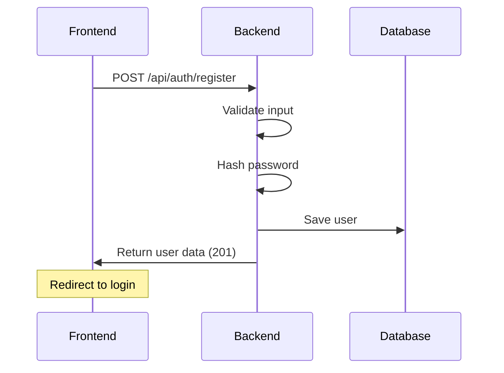
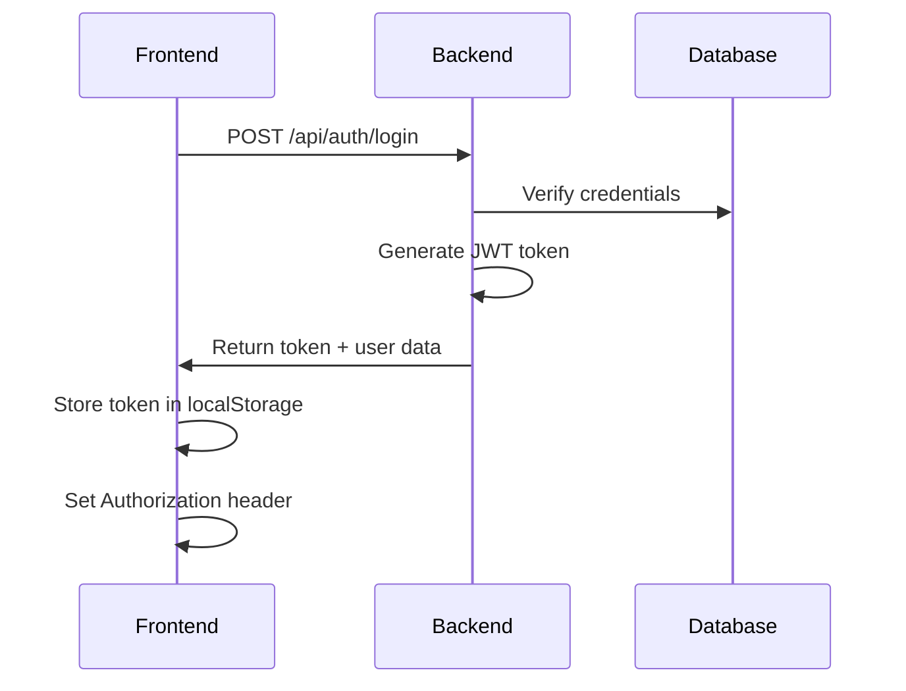
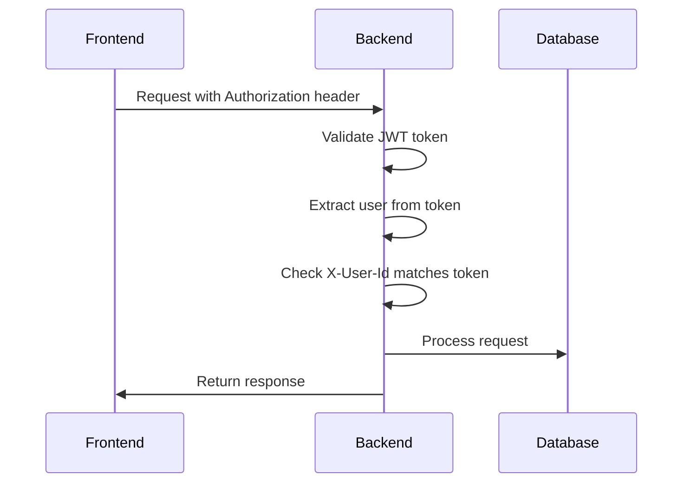

# 🚀 LocalLend Frontend Integration Guide - Mark 2
## Comprehensive Backend API Documentation & Integration Manual

**Version**: 2.0  
**Date**: November 12, 2025  
**Backend Base URL**: `http://localhost:8080`  
**Frontend Base URL**: `http://localhost:5173`

---

## 📋 Table of Contents

1. [🔐 Authentication System](#authentication-system)
2. [🏗️ API Architecture](#api-architecture)
3. [📊 Data Models & Enums](#data-models--enums)
4. [🛠️ API Endpoints](#api-endpoints)
5. [🔄 Authentication Workflows](#authentication-workflows)
6. [⚠️ Error Handling](#error-handling)
7. [🧪 Testing Guide](#testing-guide)
8. [🐛 Common Issues & Solutions](#common-issues--solutions)

---

## 🔐 Authentication System

### **JWT Token Configuration**
```properties
# Backend Configuration (application.properties)
app.jwt.secret=change-this-secret-in-production-with-a-very-long-secure-random-string-at-least-256-bits
app.jwt.expiration-ms=86400000  # 24 hours
```

### **Authentication Headers Required**
```http
# For authenticated endpoints
Authorization: Bearer {jwt_token}
X-User-Id: {user_id}
Content-Type: application/json
```

### **Public Endpoints (No Authentication Required)**
- `POST /api/auth/register`
- `POST /api/auth/login`
- `GET /api/categories/**`
- `GET /api/items/**` (browsing only)
- `GET /api/users/*/public`
- `GET /api/users/search`

### **Protected Endpoints (Authentication Required)**
- All other endpoints require valid JWT token
- X-User-Id header must match the token's user

---

## 🏗️ API Architecture

### **Base URL Structure**
```
Backend API: http://localhost:8080/api
├── /auth           # Authentication
├── /users          # User management
├── /items          # Item management
├── /categories     # Category management
├── /bookings       # Booking system
└── /ratings        # Rating system
```

### **Security Configuration**
- **CORS**: Enabled for `http://localhost:*`
- **Methods**: GET, POST, PUT, PATCH, DELETE
- **Headers**: All headers allowed including Authorization and X-User-Id
- **Session**: Stateless (JWT-based)
- **CSRF**: Disabled for API

---

## 📊 Data Models & Enums

### **ItemStatus Enum**
```java
public enum ItemStatus {
    AVAILABLE,      // Item is available for booking
    BOOKED,         // Item has been booked
    BORROWED,       // Item is currently borrowed
    MAINTENANCE,    // Item is under maintenance
    UNAVAILABLE     // Owner has marked it unavailable
}
```

### **ItemCondition Enum**
```java
public enum ItemCondition {
    NEW,
    EXCELLENT,
    GOOD,
    FAIR,
    POOR
}
```

### **BookingStatus Enum**
```java
public enum BookingStatus {
    PENDING,        // Waiting for owner approval
    CONFIRMED,      // Owner has approved
    ACTIVE,         // Booking is currently active
    COMPLETED,      // Booking completed successfully
    CANCELLED,      // Cancelled by borrower
    REJECTED        // Rejected by owner
}
```

### **RatingType Enum**
```java
public enum RatingType {
    USER_TO_ITEM,       // Rating an item
    USER_TO_USER,       // General user rating
    OWNER_TO_BORROWER,  // Owner rating borrower
    BORROWER_TO_OWNER   // Borrower rating owner
}
```

---

## 🛠️ API Endpoints

### **🔐 Authentication Endpoints**

#### **Register User**
```http
POST /api/auth/register
Content-Type: application/json

{
  "username": "johndoe",           # Required, 3-50 chars
  "name": "John Doe",              # Required, 2-100 chars
  "email": "john@example.com",     # Required, valid email
  "password": "password123",       # Required, min 8 chars
  "phoneNumber": "+1234567890"     # Optional
}
```

**Response (201 Created):**
```json
{
  "id": "user_id",
  "username": "johndoe",
  "name": "John Doe",
  "email": "john@example.com",
  "phoneNumber": "+1234567890",
  "profileImageUrl": null,
  "isActive": true,
  "createdAt": "2025-11-12T10:00:00Z"
}
```

#### **Login User**
```http
POST /api/auth/login
Content-Type: application/json

{
  "usernameOrEmail": "johndoe",    # Username or email
  "password": "password123"
}
```

**Response (200 OK):**
```json
{
  "token": "eyJhbGciOiJIUzI1NiIsInR5cCI6IkpXVCJ9...",
  "tokenType": "Bearer",
  "user": {
    "id": "user_id",
    "username": "johndoe",
    "name": "John Doe",
    "email": "john@example.com",
    "phoneNumber": "+1234567890",
    "profileImageUrl": null,
    "isActive": true,
    "createdAt": "2025-11-12T10:00:00Z"
  }
}
```

---

### **👤 User Management Endpoints**

#### **Get Current User Profile**
```http
GET /api/users/profile
Authorization: Bearer {jwt_token}
```

#### **Update Current User Profile**
```http
PUT /api/users/profile
Authorization: Bearer {jwt_token}
Content-Type: application/json

{
  "name": "John Smith",           # Optional
  "phoneNumber": "+1987654321",   # Optional
  "profileImageUrl": "https://..." # Optional
}
```

#### **Get User Public Info**
```http
GET /api/users/{userId}/public
# No authentication required
```

#### **Search Users**
```http
GET /api/users/search?term=john&page=0&size=10
# No authentication required
```

---

### **📦 Item Management Endpoints**

#### **Create Item**
```http
POST /api/items
Authorization: Bearer {jwt_token}
X-User-Id: {user_id}
Content-Type: application/json

{
  "name": "Laptop",                    # Required, 3-100 chars
  "description": "Gaming laptop",      # Optional, max 500 chars
  "categoryId": "category_id",         # Required
  "deposit": 100.0,                    # Optional, default 0.0
  "images": ["url1", "url2"],          # Optional
  "condition": "EXCELLENT"             # Optional, default GOOD
}
```

#### **Get All Available Items**
```http
GET /api/items?page=0&size=10&sortBy=name&sortDir=asc
# No authentication required
```

#### **Get Item by ID**
```http
GET /api/items/{itemId}
# No authentication required
```

#### **Search Items**
```http
GET /api/items/search?q=laptop&page=0&size=10
# No authentication required
```

#### **Get Items by Category**
```http
GET /api/items/category/{categoryId}?page=0&size=10
# No authentication required
```

#### **Get Items by Owner**
```http
GET /api/items/owner/{ownerId}?page=0&size=10
# No authentication required
```

#### **Get Current User's Items**
```http
GET /api/items/my-items?page=0&size=10
Authorization: Bearer {jwt_token}
X-User-Id: {user_id}
```

#### **Update Item**
```http
PUT /api/items/{itemId}
Authorization: Bearer {jwt_token}
X-User-Id: {user_id}
Content-Type: application/json

{
  "name": "Updated Laptop",        # Optional
  "description": "New description", # Optional
  "condition": "GOOD",             # Optional
  "deposit": 150.0,                # Optional
  "images": ["new_url"],           # Optional
  "isAvailable": true              # Optional
}
```

#### **⚠️ MISSING ENDPOINT - Item Status Update**
**❌ Frontend expects but backend doesn't have:**
```http
PATCH /api/items/{itemId}/status
Authorization: Bearer {jwt_token}
X-User-Id: {user_id}
Content-Type: application/json

{
  "status": "UNAVAILABLE"  # AVAILABLE, UNAVAILABLE, MAINTENANCE
}
```

**✅ Available alternatives:**
```http
# Toggle availability (switches between AVAILABLE/UNAVAILABLE)
PATCH /api/items/{itemId}/toggle-availability
Authorization: Bearer {jwt_token}
X-User-Id: {user_id}

# Set specific availability
PATCH /api/items/{itemId}/availability
Authorization: Bearer {jwt_token}
X-User-Id: {user_id}
Content-Type: application/json

{
  "isAvailable": false  # true = AVAILABLE, false = UNAVAILABLE
}
```

#### **Delete Item**
```http
DELETE /api/items/{itemId}
Authorization: Bearer {jwt_token}
X-User-Id: {user_id}
```

---

### **📂 Category Management Endpoints**

#### **Create Category**
```http
POST /api/categories
Authorization: Bearer {jwt_token}
Content-Type: application/json

{
  "name": "Electronics",           # Required
  "description": "Electronic items", # Optional
  "parentId": "parent_category_id"  # Optional (for subcategories)
}
```

#### **Get All Categories**
```http
GET /api/categories?sort=name
# No authentication required
```

#### **Get Category by ID**
```http
GET /api/categories/{categoryId}
# No authentication required
```

#### **Get Root Categories**
```http
GET /api/categories/root?sort=name
# No authentication required
```

---

### **📅 Booking Management Endpoints**

#### **Create Booking**
```http
POST /api/bookings
Authorization: Bearer {jwt_token}
X-User-Id: {borrower_id}
Content-Type: application/json

{
  "itemId": "item_id",
  "startDate": "2025-11-15",
  "endDate": "2025-11-20",
  "notes": "I need this for a project"  # Optional
}
```

#### **Get Booking by ID**
```http
GET /api/bookings/{bookingId}
Authorization: Bearer {jwt_token}
```

#### **Get User's Bookings (as Borrower)**
```http
GET /api/bookings/my-bookings
Authorization: Bearer {jwt_token}
X-User-Id: {user_id}

# Alternative endpoint:
GET /api/bookings/my
Authorization: Bearer {jwt_token}
X-User-Id: {user_id}
```

#### **Get Pending Approvals (as Owner)**
```http
GET /api/bookings/pending-approvals
Authorization: Bearer {jwt_token}
X-User-Id: {owner_id}
```

#### **Get Owner's Bookings**
```http
GET /api/bookings/my-owned
Authorization: Bearer {jwt_token}
X-User-Id: {owner_id}
```

#### **Approve/Confirm Booking**
```http
# New naming (Issue #15)
PATCH /api/bookings/{bookingId}/approve
Authorization: Bearer {jwt_token}
X-User-Id: {owner_id}
Content-Type: application/json

{
  "ownerNotes": "Please take care of it"  # Optional
}

# Original endpoint (still works)
PATCH /api/bookings/{bookingId}/confirm
Authorization: Bearer {jwt_token}
X-User-Id: {owner_id}
Content-Type: application/json

{
  "ownerNotes": "Please take care of it"  # Optional
}
```

#### **Start/Activate Booking**
```http
# New naming (Issue #15)
PATCH /api/bookings/{bookingId}/start
Authorization: Bearer {jwt_token}
X-User-Id: {borrower_id}

# Original endpoint (still works)
PATCH /api/bookings/{bookingId}/activate
Authorization: Bearer {jwt_token}
X-User-Id: {borrower_id}
```

#### **Complete Booking**
```http
PATCH /api/bookings/{bookingId}/complete
Authorization: Bearer {jwt_token}
X-User-Id: {borrower_id}
```

#### **Cancel Booking**
```http
PATCH /api/bookings/{bookingId}/cancel
Authorization: Bearer {jwt_token}
X-User-Id: {borrower_id}
Content-Type: application/json

{
  "reason": "Plans changed"  # Optional
}
```

#### **Reject Booking**
```http
PATCH /api/bookings/{bookingId}/reject
Authorization: Bearer {jwt_token}
X-User-Id: {owner_id}
Content-Type: application/json

{
  "reason": "Item not available"  # Optional
}
```

---

### **⭐ Rating System Endpoints**

#### **Create Rating**
```http
POST /api/ratings
Authorization: Bearer {jwt_token}
Content-Type: application/json

# Rating an item
{
  "ratingType": "USER_TO_ITEM",
  "itemId": "item_id",
  "ratingValue": 5,                    # 1-5
  "comment": "Great item!",            # Optional
  "isAnonymous": false                 # Optional, default false
}

# Rating a user
{
  "ratingType": "BORROWER_TO_OWNER",   # or OWNER_TO_BORROWER, USER_TO_USER
  "rateeId": "user_id",
  "bookingId": "booking_id",           # Optional
  "ratingValue": 4,                    # 1-5
  "comment": "Great communication!"    # Optional
}
```

#### **Get User Ratings**
```http
GET /api/ratings/user/{userId}
# No authentication required
```

#### **Get Item Ratings**
```http
GET /api/ratings/item/{itemId}
# No authentication required
```

#### **Get Rating Statistics**
```http
GET /api/ratings/user/{userId}/stats
# No authentication required

GET /api/ratings/item/{itemId}/stats  
# No authentication required
```

---

## 🔄 Authentication Workflows

### **Registration Flow**


### **Login Flow**


### **Authenticated Request Flow**


### **Token Storage & Management**
```javascript
// Frontend token management
class AuthService {
  login(credentials) {
    return api.post('/api/auth/login', credentials)
      .then(response => {
        const { token, user } = response.data;
        localStorage.setItem('token', token);
        localStorage.setItem('user', JSON.stringify(user));
        this.setAuthHeader(token);
        return { token, user };
      });
  }

  setAuthHeader(token) {
    api.defaults.headers.common['Authorization'] = `Bearer ${token}`;
  }

  logout() {
    localStorage.removeItem('token');
    localStorage.removeItem('user');
    delete api.defaults.headers.common['Authorization'];
  }

  getCurrentUser() {
    return JSON.parse(localStorage.getItem('user'));
  }

  getToken() {
    return localStorage.getItem('token');
  }

  isAuthenticated() {
    const token = this.getToken();
    if (!token) return false;
    
    // Check if token is expired
    try {
      const payload = JSON.parse(atob(token.split('.')[1]));
      return payload.exp * 1000 > Date.now();
    } catch {
      return false;
    }
  }
}
```

---

## ⚠️ Error Handling

### **Standard Error Response Format**
```json
{
  "success": false,
  "message": "Error description",
  "error_code": "ERROR_TYPE",
  "timestamp": "2025-11-12T10:00:00Z"
}
```

### **HTTP Status Codes**
- **200** - Success
- **201** - Created
- **400** - Bad Request (validation errors)
- **401** - Unauthorized (invalid/missing token)
- **403** - Forbidden (no permission)
- **404** - Not Found
- **409** - Conflict (duplicate data)
- **500** - Internal Server Error

### **Common Error Scenarios**

#### **Authentication Errors**
```json
// 401 - Invalid token
{
  "success": false,
  "message": "Invalid or expired token",
  "error_code": "INVALID_TOKEN"
}

// 403 - Insufficient permissions
{
  "success": false,
  "message": "You don't own this item",
  "error_code": "ACCESS_DENIED"
}
```

#### **Validation Errors**
```json
// 400 - Missing required fields
{
  "success": false,
  "message": "Name is required",
  "error_code": "VALIDATION_ERROR"
}
```

#### **Business Logic Errors**
```json
// 409 - Booking conflict
{
  "success": false,
  "message": "Item is already booked for this period",
  "error_code": "BOOKING_CONFLICT"
}
```

---

## 🧪 Testing Guide

### **Basic API Health Check**
```bash
# Test if backend is running
curl -I http://localhost:8080/api/categories
# Expected: HTTP/1.1 200 OK

# Test authentication endpoint  
curl -X POST http://localhost:8080/api/auth/login \
  -H "Content-Type: application/json" \
  -d '{"usernameOrEmail":"test","password":"test"}'
# Expected: 401 or valid response (not 404/500)
```

### **Authentication Testing**
```bash
# 1. Register a test user
curl -X POST http://localhost:8080/api/auth/register \
  -H "Content-Type: application/json" \
  -d '{
    "username": "testuser",
    "name": "Test User", 
    "email": "test@example.com",
    "password": "password123"
  }'

# 2. Login to get token
curl -X POST http://localhost:8080/api/auth/login \
  -H "Content-Type: application/json" \
  -d '{
    "usernameOrEmail": "testuser",
    "password": "password123"
  }'

# 3. Test authenticated endpoint
curl -X GET http://localhost:8080/api/users/profile \
  -H "Authorization: Bearer YOUR_TOKEN_HERE"
```

### **Item Management Testing**
```bash
# Test item availability endpoints (the missing one)
curl -X PATCH http://localhost:8080/api/items/ITEM_ID/status \
  -H "Content-Type: application/json" \
  -H "Authorization: Bearer TOKEN" \
  -H "X-User-Id: USER_ID" \
  -d '{"status":"UNAVAILABLE"}'
# Expected: 404 (endpoint doesn't exist)

# Test working availability endpoint
curl -X PATCH http://localhost:8080/api/items/ITEM_ID/availability \
  -H "Content-Type: application/json" \
  -H "Authorization: Bearer TOKEN" \
  -H "X-User-Id: USER_ID" \
  -d '{"isAvailable":false}'
# Expected: 200 with updated item
```

---

## 🐛 Common Issues & Solutions

### **Issue 1: "Make Unavailable" Button Not Working**

**Problem**: Frontend calls `PATCH /api/items/{id}/status` but backend doesn't have this endpoint.

**Root Cause**: Mismatch between frontend expectations and backend implementation.

**Solutions**:

**Option A: Update Frontend (Recommended)**
```javascript
// Change in itemService.ts
updateItemStatus: async (itemId: string, status: ItemStatus, userId: string): Promise<Item> => {
  // Instead of:
  // const response = await api.patch(`/api/items/${itemId}/status`, { status }, {
  
  // Use:
  const isAvailable = status === 'AVAILABLE';
  const response = await api.patch(`/api/items/${itemId}/availability`, { isAvailable }, {
    headers: addUserIdHeader(userId)
  });
  return response;
}
```

**Option B: Add Missing Backend Endpoint**
```java
// Add to ItemController.java
@PatchMapping("/{id}/status")
public ResponseEntity<?> updateItemStatus(
        @PathVariable String id,
        @RequestBody Map<String, String> request,
        @RequestHeader(value = "X-User-Id", required = true) String userId) {
    
    try {
        String status = request.get("status");
        if (status == null) {
            return ResponseEntity.badRequest()
                .body(Map.of("error", "Status is required"));
        }
        
        // Convert status to availability
        boolean isAvailable = "AVAILABLE".equals(status.toUpperCase());
        ItemDTO updatedItem = itemService.setAvailability(id, isAvailable, userId);
        return ResponseEntity.ok(updatedItem);
    } catch (Exception e) {
        return ResponseEntity.status(HttpStatus.BAD_REQUEST)
            .body(Map.of("error", e.getMessage()));
    }
}
```

### **Issue 2: CORS Errors**

**Problem**: Frontend can't reach backend due to CORS policy.

**Solution**: Backend already has CORS configured correctly:
```java
@CrossOrigin(origins = "*", maxAge = 3600)  // On controllers
```

### **Issue 3: Authentication Failures**

**Common Problems**:
1. **Missing X-User-Id header**
2. **Token format issues** (missing "Bearer " prefix)
3. **Expired tokens** (24-hour expiration)

**Frontend Fix**:
```javascript
// Ensure proper headers
const addUserIdHeader = (userId) => ({
  'X-User-Id': userId,
  'Authorization': `Bearer ${localStorage.getItem('token')}`
});
```

### **Issue 4: Static Resource Errors**

**Problem**: Getting "No static resource" instead of API responses.

**Causes**:
1. Backend not running on port 8080
2. Wrong URL (missing `/api` prefix)
3. Spring Boot serving static files instead of API

**Solutions**:
1. Verify backend is running: `curl http://localhost:8080/api/categories`
2. Check application.properties for conflicting static mappings
3. Ensure controllers are properly registered

---

## 📝 Frontend Implementation Checklist

### **Authentication Integration**
- [ ] Implement login/register forms
- [ ] Store JWT token in localStorage
- [ ] Set Authorization header on all authenticated requests
- [ ] Include X-User-Id header where required
- [ ] Handle token expiration (401 responses)
- [ ] Implement logout functionality

### **Item Management Integration**
- [ ] ⚠️ **Fix item status update** (use `/availability` endpoint)
- [ ] Implement item creation form
- [ ] Add item browsing/search functionality
- [ ] Handle image uploads properly
- [ ] Implement owner-only actions (edit/delete)

### **Booking System Integration**
- [ ] Create booking request form
- [ ] Implement booking approval workflow
- [ ] Add booking status tracking
- [ ] Handle booking state transitions
- [ ] Display pending approvals for owners

### **Rating System Integration**
- [ ] Add rating creation forms
- [ ] Display ratings on items/users
- [ ] Implement rating statistics
- [ ] Handle different rating types

### **Error Handling**
- [ ] Implement global error interceptor
- [ ] Handle authentication errors
- [ ] Display user-friendly error messages
- [ ] Add loading states

---

## 🎯 Quick Start Checklist

1. **Start Backend**: `mvn spring-boot:run` (port 8080)
2. **Start Frontend**: `npm run dev` (port 5173)  
3. **Test Registration**: Create a test user
4. **Test Login**: Get JWT token
5. **Test Authenticated Endpoint**: Use token to access protected routes
6. **Fix Item Status Issue**: Update frontend to use `/availability` endpoint

---

## 📞 Support & Troubleshooting

### **Backend Logs**
```bash
# Check Spring Boot logs for errors
mvn spring-boot:run

# Look for:
✅ "Started Application in X seconds"
✅ "Mapping servlet: 'dispatcherServlet' to [/]"
❌ Authentication/authorization errors
❌ Database connection issues
```

### **Frontend Debugging**
```javascript
// Add to browser console for debugging
console.log('Token:', localStorage.getItem('token'));
console.log('User:', localStorage.getItem('user'));

// Check API calls in Network tab
// Verify Authorization headers are set
// Check response status codes
```

### **Common Commands**
```bash
# Backend health check
curl http://localhost:8080/api/categories

# Test authentication
curl -X POST http://localhost:8080/api/auth/login \
  -H "Content-Type: application/json" \
  -d '{"usernameOrEmail":"test","password":"test"}'

# Test protected endpoint
curl -X GET http://localhost:8080/api/users/profile \
  -H "Authorization: Bearer YOUR_TOKEN"
```

---

**This guide should provide everything needed for successful frontend-backend integration. The key issue identified is the missing `/status` endpoint - fix this first for the "Make Unavailable" button to work!**